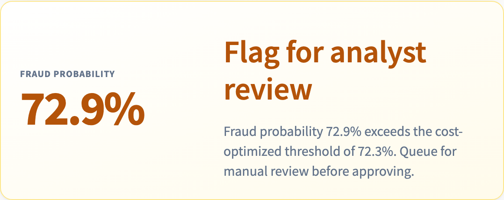
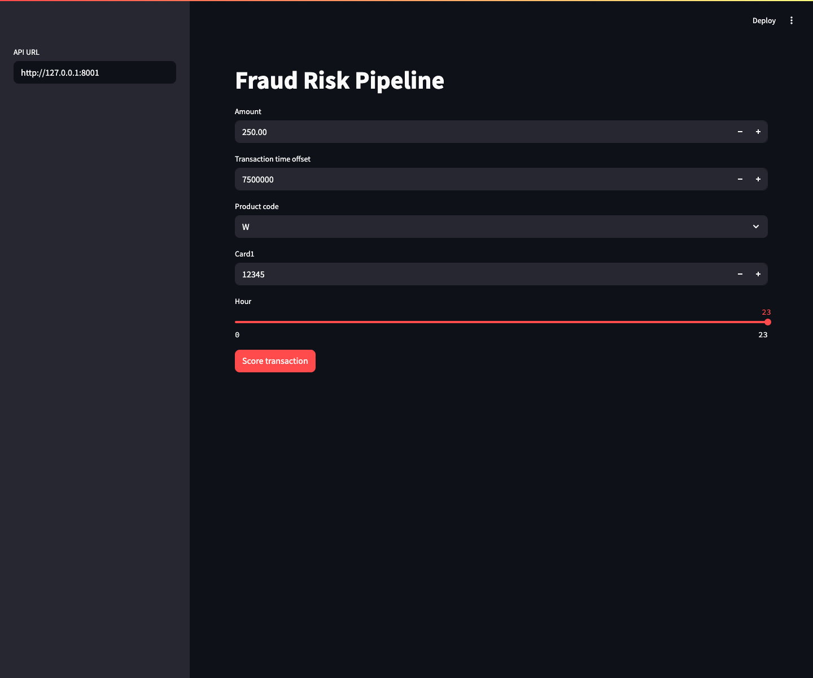
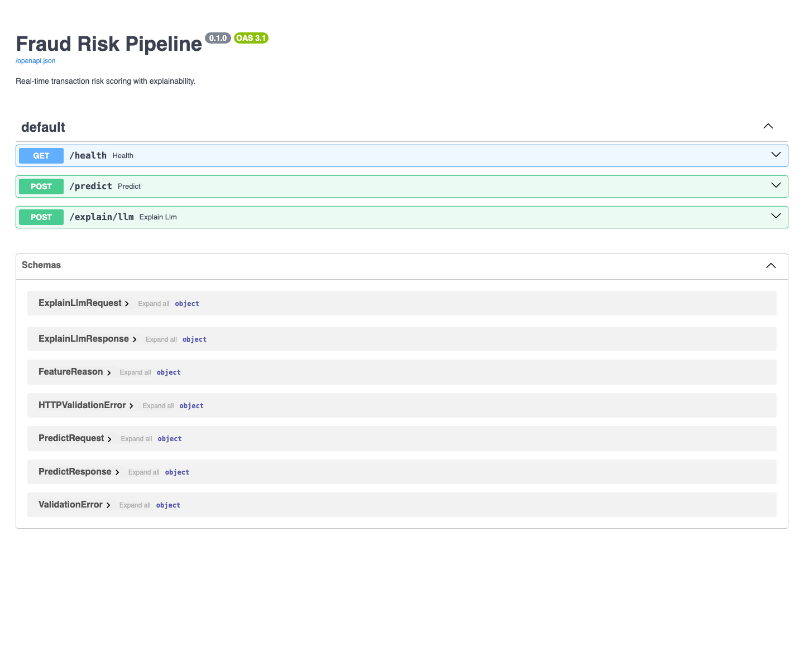
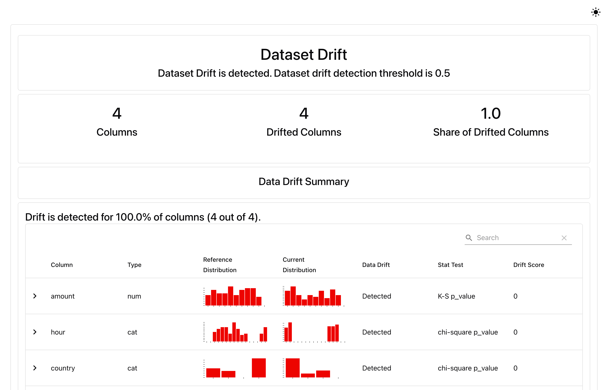

# Real-Time Transaction Risk & Fraud Detection Pipeline

[](https://adit-txn-risk-pipeline-ui.herokuapp.com/)
[](https://adit-txn-risk-pipeline-41ee5a80b27b.herokuapp.com/docs)

A real-time transaction-risk system: imbalanced-data fraud model with cost-based thresholding, Tree SHAP explainability, Evidently drift monitoring, and a reusable template-based analyst summary (same framing as a healthcare risk console; optional LLM on-demand in V2).

## Demo Screenshots

Prediction examples from the local `/predict` API:



Streamlit scoring form:



FastAPI contract:



Evidently drift report:



## What This Shows

This is a production-style fraud/risk service, not a notebook. A user sends a transaction to the API or demo UI and receives:

- fraud probability from the committed XGBoost model artifact
- decision at a documented threshold
- top feature contributions using XGBoost Tree SHAP values
- plain-English analyst summary

Scoring path:

`transaction -> feature alignment -> XGBoost -> probability + threshold decision -> Tree SHAP -> analyst summary`

The analyst summary is template-based from SHAP drivers and uses the same cost-based threshold as the API decision (not a fixed 0.5 cutoff).

## Feature Surface

| Area | What is implemented |
| --- | --- |
| Real-time API | `GET /health`, `POST /predict`, and optional `POST /explain/llm` |
| Model serving | Committed IEEE-CIS XGBoost artifact loaded from `artifacts/xgboost_model.json` |
| Thresholding | Cost-based threshold from `artifacts/threshold.json` (`0.722727`) |
| Feature alignment | Sparse request payloads are aligned to the trained IEEE feature list, with zero-fill fallback for missing fields |
| Explanations | Tree SHAP top feature contributions with risk direction labels |
| Analyst summary | Deterministic template summary on `/predict`; optional Hugging Face LLM summary only on `/explain/llm` |
| UI | Streamlit client with editable transaction amount, time offset, product code, card id, hour, and API URL |
| Monitoring | Evidently drift report comparing committed reference/current slices |
| Deploy | API + Streamlit UI on Heroku; Fly.io config available as an alternative |

## API

```bash
curl -X POST http://localhost:8000/predict \
  -H "Content-Type: application/json" \
  -d '{"transaction":{"TransactionAmt":250,"TransactionDT":7500000,"ProductCD":"W","card1":12345}}'
```

Response shape:

```json
{
  "fraud_probability": 0.83,
  "decision": "flag_for_review",
  "threshold": 0.722727,
  "top_features": [
    {
      "feature": "TransactionAmt",
      "shap_value": 0.31,
      "direction": "increases_risk"
    }
  ],
  "analyst_summary": "Flagged for review: elevated risk signals include TransactionAmt and transaction_hour."
}
```

### Local prediction examples

These values were produced by the committed model artifact through the local API.

| Scenario | `TransactionAmt` | `hour` | `ProductCD` | `card1` | Fraud probability | Decision | Top increasing drivers |
| --- | ---: | ---: | --- | ---: | ---: | --- | --- |
| Low amount, early hour | 24.50 | 1 | W | 1000 | 0.335307 | `approve` | C14 |
| Demo default values | 250.00 | 23 | W | 12345 | 0.728981 | `flag_for_review` | C14, TransactionAmt, D2, card6 |
| High amount, product C | 1250.00 | 3 | C | 17000 | 0.759150 | `flag_for_review` | TransactionAmt, C14, card6 |

## Metrics

| Model | Split | PR-AUC | Precision | Recall | Threshold |
| --- | --- | ---: | ---: | ---: | ---: |
| XGBoost v1 | IEEE-CIS time-based final 20% | 0.440 | 0.306 | 0.541 | 0.723 |

Accuracy is intentionally not used as the headline metric because fraud data is highly imbalanced.

The committed `data/sample.csv` remains tiny so the repo can run without the full Kaggle download. Full training metrics above come from the IEEE-CIS Kaggle dataset.

## Local Development

```bash
make install
make test
make serve
make monitor   # Evidently drift HTML + JSON under docs/media/
```

Then visit `http://localhost:8000/docs`.

### On-demand LLM summary (Hugging Face)

`/predict` stays fast with the template analyst summary. For an optional LLM note via [Hugging Face serverless inference](https://huggingface.co/docs/api-inference/index), set `HF_API_TOKEN` (and optionally `HF_MODEL_ID`) in `.env`, then:

```bash
curl -X POST http://localhost:8000/explain/llm \
  -H "Content-Type: application/json" \
  -d '{"transaction":{"TransactionAmt":250,"TransactionDT":7500000,"ProductCD":"W","card1":12345}}'
```

The response includes both `template_summary` and `llm_summary` plus the usual score, decision, and SHAP drivers.

Streamlit UI (API must be running):

```bash
make ui
```

If the API is running on another local port:

```bash
FRAUD_API_URL=http://127.0.0.1:8001 make ui
```

Point the UI at the hosted API:

```bash
FRAUD_API_URL=https://adit-txn-risk-pipeline-41ee5a80b27b.herokuapp.com make ui
```

## Deploy (Heroku)

Two apps from this repo: **API** (root `Procfile`) and **Streamlit UI** (`ui/` via subdirectory buildpack).

| App | URL |
| --- | --- |
| API | https://adit-txn-risk-pipeline-41ee5a80b27b.herokuapp.com/docs |
| UI | https://adit-txn-risk-pipeline-ui.herokuapp.com/ |

```bash
# API (once)
git push heroku main

# UI (once: create app, buildpacks, config)
heroku create adit-txn-risk-pipeline-ui
heroku buildpacks:add -a adit-txn-risk-pipeline-ui https://github.com/timanovsky/subdir-heroku-buildpack
heroku buildpacks:add -a adit-txn-risk-pipeline-ui heroku/python
heroku config:set PROJECT_PATH=ui \
  FRAUD_API_URL=https://adit-txn-risk-pipeline-41ee5a80b27b.herokuapp.com \
  -a adit-txn-risk-pipeline-ui
git push heroku-ui main
```

Set `HF_API_TOKEN` on the **API** app only if you use `POST /explain/llm`.

## Deploy (Fly.io)

Requires [Fly CLI](https://fly.io/docs/hands-on/install-flyctl/) and a Fly account.

```bash
fly apps create fraud-risk-pipeline   # once
fly deploy
fly open /docs
```

The `Dockerfile` bundles `artifacts/xgboost_model.json` and serves FastAPI on port 8000. Override `RISK_THRESHOLD` or `MODEL_ARTIFACT_PATH` with `fly secrets set` if needed.

## Drift monitoring

`make monitor` compares `data/monitoring_reference.csv` (reference) to `data/monitoring_current.csv` (current) on `amount`, `hour`, `merchant`, and `country`, then writes:

- `docs/media/drift_report.html` — interactive Evidently report
- `docs/media/drift_summary.json` — compact drift summary for CI or dashboards

## Full Training

The full IEEE-CIS run is executed on Kaggle with GPU enabled:

https://www.kaggle.com/code/aditya2402/fraud-risk-pipeline-ieee-cis-train

The reproducible kernel source lives in `kaggle_kernel/`. It writes the committed model and metric artifacts in `artifacts/`.

## Project Status

Current state: FastAPI serves the committed IEEE-CIS XGBoost model with Tree SHAP reasons, cost-aligned analyst summaries, Streamlit scoring UI, optional on-demand HF LLM summaries, Evidently drift reports, Fly.io deploy config, and smoke tests.

Local status checked on June 1, 2026:

- `make test` passes: 14 tests.
- `make lint` passes.
- Graphify code graph refreshed: 300 nodes, 389 edges, 34 communities.
- Branch `main` is one commit ahead of `origin/main`; Fly.io deploy and live README badge are still pending.

## Agent tooling (Serena)

Python LSP is enabled in `.serena/project.yml` (`languages: [python]`, Pyright via `.venv/bin/python`). After changing Serena config, restart the Serena MCP server in Cursor so symbol navigation works.

Graphify output is generated under `graphify-out/` and ignored by git. Refresh it with `graphify update .` after meaningful code changes.

## V2 Roadmap

- streaming ingestion
- Airflow/dbt/warehouse
- feature store
- auth/API tokens
- fine-tuned or self-hosted LLM
